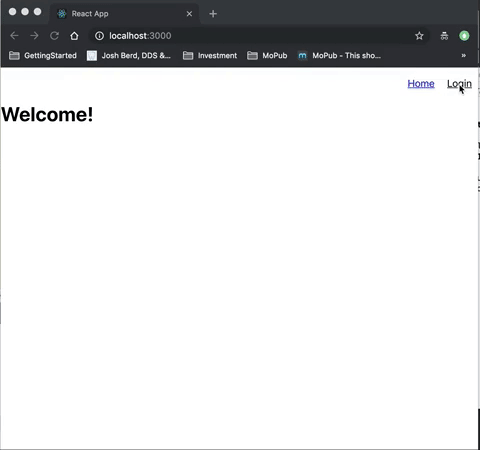

# Authenticate Twitter via passport

### About

This is a simple web authentication web application via Twitter OAuth. Please feel free to fork this and build your own application. If you have any questions, please feel free to send me an issue or a pull request.

### Demo



---

### Server

Run on express server

```
cd server/
nodemon index.js
```

Go to localhost:4000

### Client

```
cd client/
yarn install
yarn run start
```

Go to localhost:3000

### Instructions

- Rename `/server/config/keys.copy.js` to `/server/config/keys.js` and add your keys
- You can follow my online tutorial
- Server: https://medium.com/@leannezhang/building-a-web-application-twitter-oauth-using-passport-js-part-1-9ffa6f49ef0

- Client: https://medium.com/@leannezhang/login-logout-page-using-react-5989eb289047
